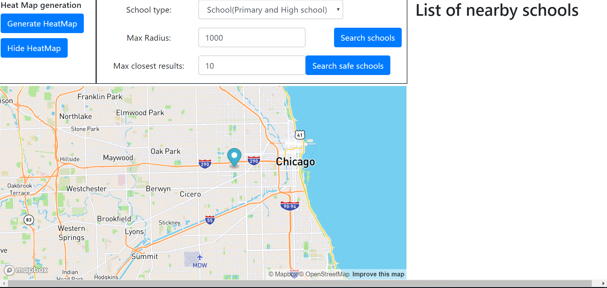
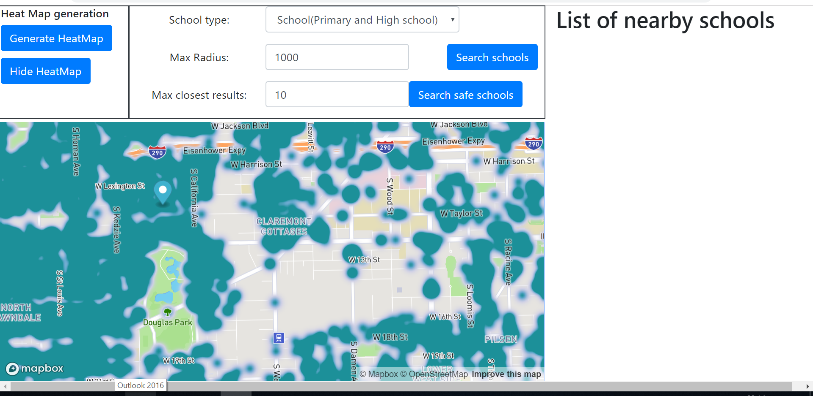
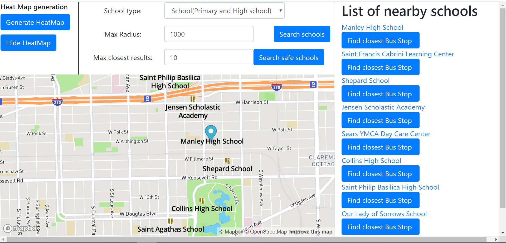
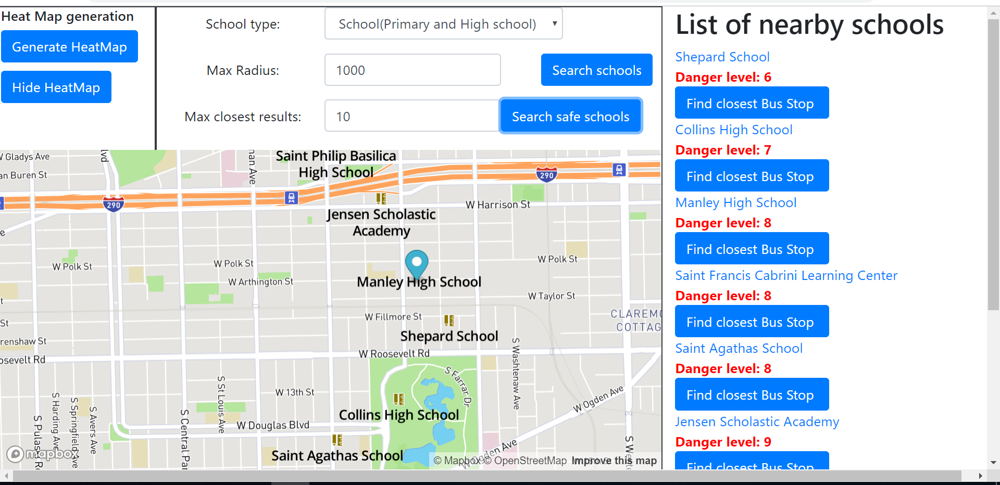
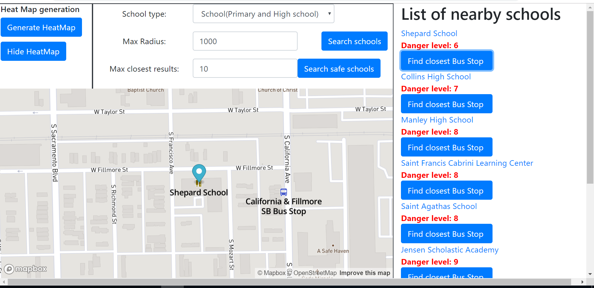
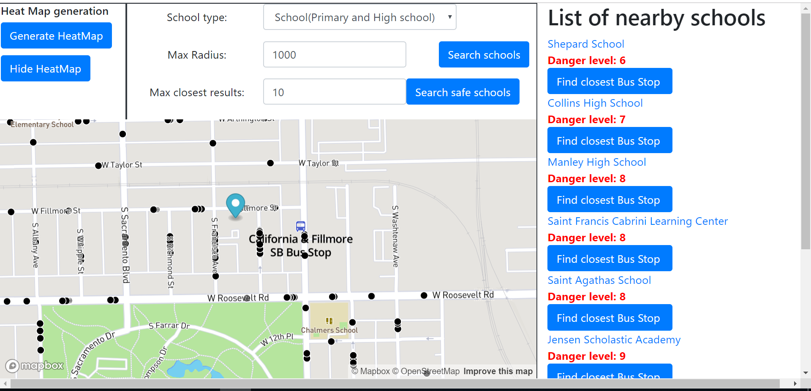
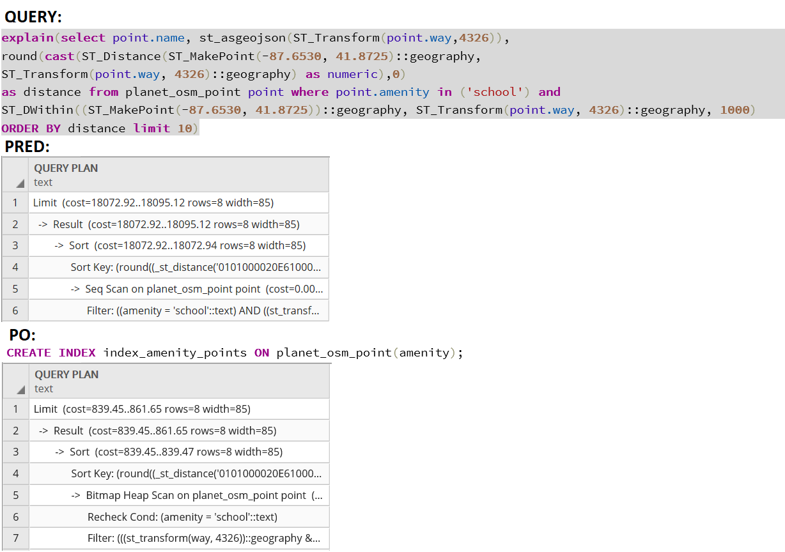
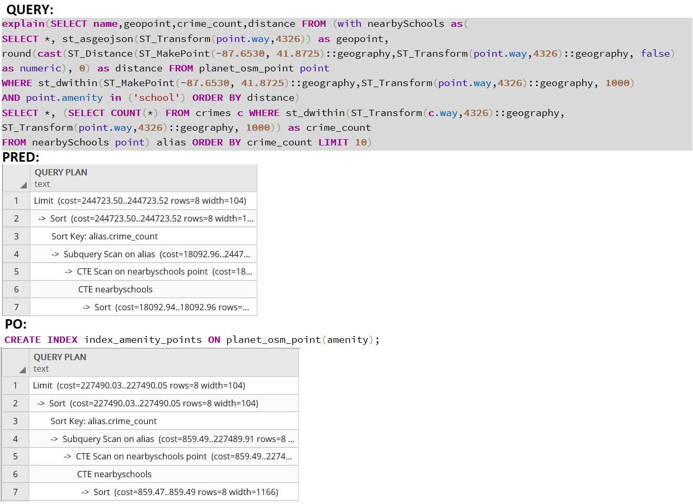
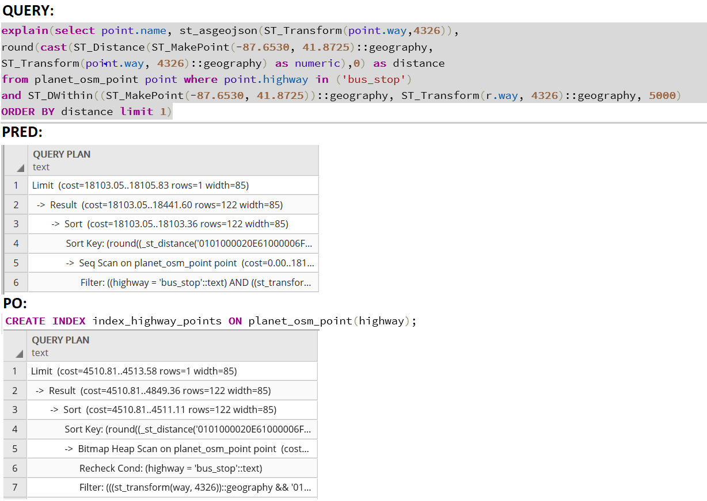

# Overview

Aplikácia bezpečné školy poskytuje tieto funkcie v oblasti mesta Chicago:
- nájde od vybraného miesta všetky školy, zoradené od najbližšej
- školy je možné filtrovať nastavením rádiusu vyhľadávania, limitom na počet nájdených výsledkov, a taktiež typom školy (aplikácia poskytuje filtrovanie tých typov: školy (základné a stredné), škôlky a vysoké školy (univerzity))
- zobrazenie heat mapy zločinov za posledný rok z externého zdroja údajov (posledný rok v tomto zdroji je 2016)
- rovnaké filtrovanie aké som už uviedol vyššie akurát v tomto prípade sa berie dp  úvahy externý dátový zdroj kriminality a vyhľadajú sa školy a k ním je priradený stupeň nebezpečenstva (danger level), podľa neho sú aj školy zaradzované, najbezpečnejšie školy sú zobrazené vyššie v liste vyhľadávania
- k vybranej škole, ktorú používateľ našiel podľa filtra je možné nájsť najbližšiu autobusová zástavku
- všetky tieto vrstvy sú kombinovateľné a pri vyhľadaní škôl používateľ vidí kriminalitu vo vybranej oblasti (ak si zvolil zobrazenie heat mapy)

Ukážky týchto scenárov:

Úvodná obrazovka



Heat mapa zločinov v Chicagu:



Vyhľadanie škôl podľa nastaveného filtra, vyhľadané školy sú zobrazené v zozname s možnosťou kliknutia pre rýchle priblíženie:



Vyhľadanie bezpečných škôl podľa nastaveného filtra so zobrazeným stupňa nebezpečenstva:



Nájdenie najbližšej autobusovej zástavky pre vybranú školu:



Kombinácia vrstiev vyhľadávania školy a heat mapy pre zločiny v Chicagu:



Celá aplikácia je riešená ako maven project. Delí sa na dve častí: [frontend](#frontend), kde je použitý thymeleaf, a mapbox-gl.js a komunikuje pomocou [REST API](#api) s [backend application](#backendom), ktorý je napísaný v jave s použitím [Spring Bootu](http://spring.io/projects/spring-boot), ktorý komunikuje cez dopyty s [PostgreSQL](https://www.postgresql.org/), ktorá používa rozšírenie [PostGIS](https://postgis.net/) na prácu s geo dátami.

# Frontend

Frontend pozostáva len so statickej stránky (`index.html`), ktorá zabezpečuje zobrazenie mapbox-gl.js. Zobrazuje všetky akcie, ktoré používateľ vykoná, teda zobrazenie vyhľadaných škôl, heat mapu kriminality, najbližšiu zastávku a danger level vyhľadaných škôl. Taktiež zobrazuje filter, všetky interakčné možnosti(vyhľadávanie, heat mapa), ktoré môže používateľ vykonať. A taktiež list výsledkov, ktoré boli vyhľadané. Všetok relevantný kód sa nachádza v `index.html`. 

# Backend

Backend ako som už spomenul je napísaný v jave a využíva spring boot. Obsahuje dopyty do databázy a samozrejme zabezpečuje transformáciu do požadovaného geojson formátu. Jednotlivé dopyty je možné nájsť v súbore `DatabaseQueries.java`.

## Data

Dáta mestá Chicago pochádzajú z Open Street Maps a majú viac ako 1.2GB veľkosť. Dáta boli importované do PostgreSQL databázy pomocou nástroja `osm2pgsql`. Ďalej sme využívali dátový zdroj kriminality mesta Chicago z [Kaggle](https://www.kaggle.com/). Použití dáta sú uvedené v `readme.MD`.

## Dopyty

V projekte boli použité 4 typy dopytov, ktoré ako som už spomenul sa nachádzajú v súbore `DatabaseQueries.java`. V súbore `queries.sql` je z každého typu vybraný jeden reálny príklad na ukážku. tieto príkaldy boli použité pri optimalizácií dopytov a boli vytvorené tieto indexy: `CREATE INDEX index_amenity_points ON planet_osm_point(amenity)` , `CREATE INDEX index_highway_points ON planet_osm_point(highway)`, `CREATE INDEX index_type_crimes ON crimes(primary_type)`, aj tieto indexy sa nachádzajú v spomentom súbore.
Výsledne zlepšenie pre jednotlivé dopyty vypadá nasledovne:

-nájdi najbližšie školy



-nájdi bezpečné školy



-nájdi najbližšiu autobusovú zástavku




## Api

Api poskytuje tieto služby:

**Vráť mi kriminálnu činnosť za posledný rok**

`POST /getCrimes`

**Nájdi školy**

`POST /getSchools`

**Nájdi bezpečné školy**

`POST /getSchoolsWithCrimeCounts`

**Nájdi najbližšiu autobusovú zástavku**

`POST /getNearestBusStop`

Jednotlivé REST API služby je možné nájsť v súbore `PDTController.java`
### Request payload
Príklad request payloadu pre nájdene školy:
```
{
  latitude: 41.87
  limit: "10"
  longitude: -87.7
  radius: "1000"
  schoolType: "school"
}
```

### Response
Príklad odpovede na dopyt 
`POST /getSchools` s vyššie uvedený payloadom
```
{
  "type": "Feature", 
  "geometry": 
   {
   "type":"Point",
   "coordinates":[-87.6998345,41.8707649004763]},
   "properties": 
     {
     "title": "Manley High School"
     }
   }
}
```
`geojson` obsahuje nájdené školy podľa používateľových preferencií.
